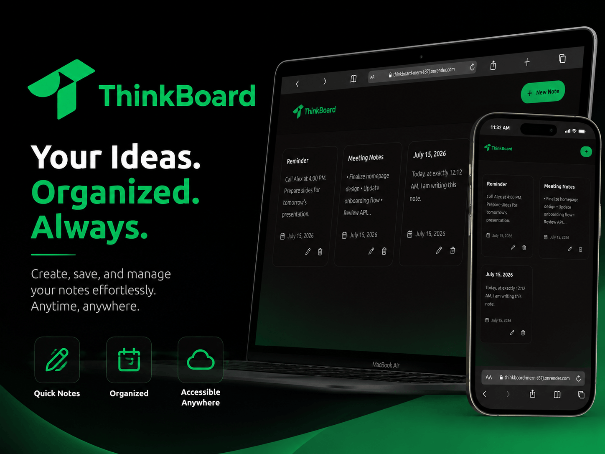

# ThinkBoard MERN

A modern, full-stack, secure note-taking application built with the MERN stack (MongoDB, Express 5, React 19, Node.js), featuring **Google OAuth 2.0 Single Sign-On**, **Guest Account Mode**, **Automatic Guest-to-Google Note Migration**, and **Strict Per-User Note Isolation**.

**[1. Live Demo](https://test-thinkboard.vercel.app)** (Hosted on Vercel)

**[2. Live Demo](https://thinkboard-mern-t87j.onrender.com)** (Hosted on Render)



---

## 🚀 Key Features

- **🔐 Google OAuth 2.0 & Guest Authentication**:
  - Sign in seamlessly using Google OAuth 2.0 with a modern, customized Google Sign-In interface.
  - **Guest Mode**: Instant trial mode allowing users to create and test notes without creating an account or providing email details.
- **🔄 Automatic Note Migration**:
  - Transfer and merge all temporary guest notes into a permanent Google account upon Google Sign-In.
- **🛡️ Per-User Data Isolation & Security**:
  - Notes are strictly isolated per user in MongoDB.
  - Protected API endpoints enforced with JSON Web Tokens (JWT) middleware to ensure users can only view, edit, and delete their own private notes.
- **🎨 Modern Aesthetic & Mobile Responsive**:
  - Vibrant dark-mode glassmorphism interface built with React 19, Tailwind CSS, DaisyUI, and Lucide React icons.
  - Minimalist Navbar with an animated profile avatar dropdown displaying full user details and single-click logout.
  - Fully responsive design tailored for mobile viewports (320px+), tablets, and desktop displays.
  - Graceful avatar fallback — automatically displays user initials when profile images fail to load or are rate-limited.
- **⚡ Fail-Open Rate Limiting**:
  - Integrated API rate limiting using Upstash Redis with fail-open fallback handling to protect endpoints against abuse without compromising service availability.

---

## 🛠️ Tech Stack

### Frontend
- **Framework:** React 19 + Vite 8
- **Authentication:** `@react-oauth/google`
- **Styling:** Tailwind CSS (v3) + DaisyUI
- **Icons:** Lucide React
- **Routing:** React Router v8
- **HTTP Client:** Axios (with automatic JWT Authorization request interceptors)
- **Notifications:** React Hot Toast

### Backend
- **Runtime:** Node.js (v18+)
- **Framework:** Express.js (v5)
- **Database:** MongoDB (via Mongoose 9 ORM)
- **Tokens & Auth:** JSON Web Tokens (`jsonwebtoken`), `google-auth-library`
- **Rate Limiting:** Upstash Redis (`@upstash/ratelimit`, `@upstash/redis`)

---

## 📦 Project Structure

```text
mern-thinkboard/
├── backend/                  # Express API Server (Vercel Serverless Function)
│   ├── src/
│   │   ├── config/           # MongoDB (db.js) & Upstash Redis (upstash.js) config
│   │   ├── controllers/      # authController.js & notesController.js
│   │   ├── middleware/       # authMiddleware.js & rateLimiter.js
│   │   ├── models/           # User.js & Note.js Mongoose schemas
│   │   ├── routes/           # authRoutes.js & notesRoutes.js
│   │   └── server.js         # Express server entry point
│   ├── vercel.json           # Vercel backend routing & @vercel/node builder config
│   ├── .env                  # Backend environment configuration
│   └── package.json
├── frontend/                 # React SPA Frontend (Vercel Static Deployment)
│   ├── src/
│   │   ├── assets/           # Application assets & thumbnails
│   │   ├── components/       # ConfirmDialog, Navbar, NoteCard, NoteEditor, NotesNotFound, ProtectedRoute, RateLimitedUI
│   │   ├── context/          # AuthContext (JWT & OAuth session management)
│   │   ├── lib/              # Axios instance configuration (axios.js)
│   │   ├── pages/            # LoginPage, HomePage, CreatePage, NoteDetailPage
│   │   ├── App.jsx           # Application routing layout
│   │   └── main.jsx          # React DOM entry with Google OAuth Provider
│   ├── vercel.json           # Vercel frontend SPA rewrite & COOP headers config
│   ├── .env                  # Frontend environment configuration
│   └── package.json
├── some-notes.txt            # Local reference notes
├── package.json              # Root package for production builds & deployment
└── README.md                 # Project documentation
```

---

## ⚙️ Getting Started

### Prerequisites
- **Node.js**: v18.0.0 or higher
- **MongoDB**: Local MongoDB instance or MongoDB Atlas Cluster connection string
- **Google Cloud Console Account**: OAuth 2.0 Client ID setup

---

### Environment Setup

#### 1. Backend Environment Variables (`backend/.env`)
Create a `.env` file in the `backend/` directory:

```env
PORT=5001
MONGO_URI=mongodb+srv://<username>:<password>@cluster.mongodb.net/thinkboard?retryWrites=true&w=majority
JWT_SECRET=your_super_secret_jwt_key_here
GOOGLE_CLIENT_ID=your_google_client_id.apps.googleusercontent.com

# Optional: Upstash Redis Rate Limiting Configuration
UPSTASH_REDIS_REST_URL=https://your-redis-url.upstash.io
UPSTASH_REDIS_REST_TOKEN=your_upstash_redis_token

NODE_ENV=development
```

#### 2. Frontend Environment Variables (`frontend/.env`)
Create a `.env` file in the `frontend/` directory:

```env
VITE_GOOGLE_CLIENT_ID=your_google_client_id.apps.googleusercontent.com
VITE_API_URL=http://localhost:5001/api
```

---

### Installation & Running Locally

1. **Clone the Repository**
   ```bash
   git clone https://github.com/taher-dev/thinkboard-mern.git
   cd mern-thinkboard
   ```

2. **Install Dependencies**
   Run from the root directory to install dependencies for both frontend and backend:
   ```bash
   npm run build
   ```
   *Or install individually:*
   ```bash
   npm install --prefix backend
   npm install --prefix frontend
   ```

3. **Start Development Servers**
   Open two terminal windows to run both servers concurrently:

   **Terminal 1 (Backend Server):**
   ```bash
   cd backend
   npm run dev
   ```

   **Terminal 2 (Frontend Server):**
   ```bash
   cd frontend
   npm run dev
   ```

   - **Frontend App**: `http://localhost:5173`
   - **Backend API**: `http://localhost:5001/api`

---

## 🔑 Google OAuth Setup Guide

1. Navigate to the [Google Cloud Console Credentials Page](https://console.cloud.google.com/apis/credentials).
2. Create an **OAuth 2.0 Client ID** (Application type: **Web application**).
3. Add **Authorized JavaScript Origins**:
   - `http://localhost:5173`
   - `<your-frontend-url>`
4. Add **Authorized Redirect URIs**:
   - `http://localhost:5173`
   - `<your-frontend-url>`
5. Set your Client ID in `frontend/.env` (`VITE_GOOGLE_CLIENT_ID`) and `backend/.env` (`GOOGLE_CLIENT_ID`).
6. Set your Client Secret in `backend/.env` (`GOOGLE_CLIENT_SECRET`).

---

## 📡 API Endpoints

### Authentication Routes (`/api/auth`)
| Method | Endpoint | Access | Description |
| :--- | :--- | :--- | :--- |
| `POST` | `/api/auth/guest` | Public | Initializes a temporary guest account |
| `POST` | `/api/auth/google` | Public | Authenticates Google user & merges existing guest notes |
| `GET` | `/api/auth/me` | Protected | Fetches currently logged-in user details |

### Notes Routes (`/api/notes`)
| Method | Endpoint | Access | Description |
| :--- | :--- | :--- | :--- |
| `GET` | `/api/notes` | Protected | Fetches all notes belonging to the logged-in user |
| `GET` | `/api/notes/:id` | Protected | Fetches a specific note by ID (user ownership enforced) |
| `POST` | `/api/notes` | Protected | Creates a new note for the logged-in user |
| `PUT` | `/api/notes/:id` | Protected | Updates an existing note (user ownership enforced) |
| `DELETE` | `/api/notes/:id` | Protected | Deletes a note (user ownership enforced) |

---

## 🚀 Production Deployment

### Option A: Deploying to Vercel (Frontend & Backend)

The project includes pre-configured `vercel.json` files for both frontend and backend deployments on [Vercel](https://vercel.com).

#### 1. Backend API Deployment (Vercel Serverless Function)
1. Import your project repository into Vercel as a new project.
2. Set **Root Directory** to `backend`.
3. Framework Preset: **Other** / **Node.js**.
4. Configure Environment Variables in Vercel Project Settings:
   - `MONGO_URI`
   - `PORT=5001`
   - `JWT_SECRET`
   - `GOOGLE_CLIENT_ID`
   - `GOOGLE_CLIENT_SECRET`
   - `UPSTASH_REDIS_REST_URL`
   - `UPSTASH_REDIS_REST_TOKEN`
   - `NODE_ENV=production`
   - `CLIENT_URL=<your-frontend-url>`
   
5. Deploy backend app and copy the backend URL.

#### 2. Frontend SPA Deployment (Vercel Static Site)
1. Import your project repository into Vercel as a second project (or separate app).
2. Set **Root Directory** to `frontend`.
3. Framework Preset: **Vite**.
4. Configure Build Command: `npm run build` and Output Directory: `dist`.
5. Configure Environment Variables in Vercel Project Settings:
   - `VITE_GOOGLE_CLIENT_ID`
   - `VITE_API_URL` (Set to your deployed backend API URL, e.g., `https://test-thinkboard-bpvc.vercel.app/api`)
6. Deploy frontend app and copy the frontend URL.
7. Paste the frontend URL in the `CLIENT_URL` environment variable of the backend app.

---

### Option B: Full-Stack Deployment on Render
1. Create a new **Web Service** on [Render](https://render.com) linked to your GitHub repository.
2. Configure build settings:
   - **Build Command**: `npm run build`
   - **Start Command**: `npm start`
3. Add Environment Variables in the Render Dashboard:
   - `MONGO_URI`
   - `JWT_SECRET`
   - `GOOGLE_CLIENT_ID`
   - `VITE_GOOGLE_CLIENT_ID`
   - `NODE_ENV=production`
   - `UPSTASH_REDIS_REST_URL`
   - `UPSTASH_REDIS_REST_TOKEN`

---

## 📄 License
This project is open source and available under the [MIT License](LICENSE).

